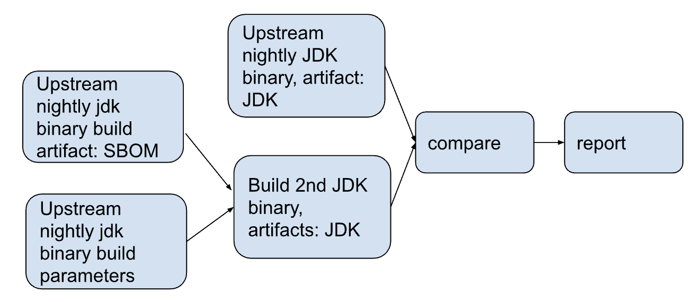
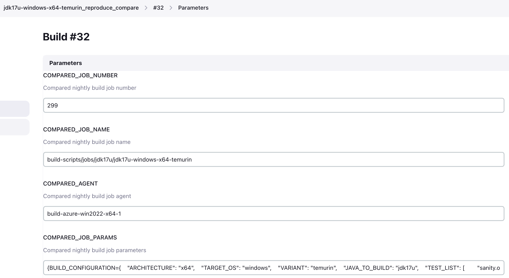
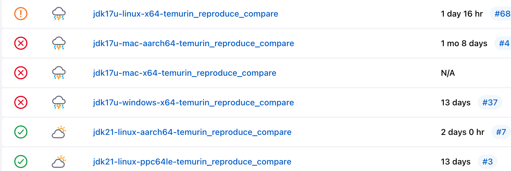

Recently JDK17 and JDK21 reproducible comparison builds have been enabled in Adoptium CI Jenkins, which aids in creating JDKs that work as intended across different environments and platforms. In this article we’ll explore why reproducible comparison builds are essential, how we implemented them and what we will do next.

## Why Reproducibility Matters

### Confidence in the high quality of the process to create the binaries

Reproducibility refers to the ability to recreate a software build consistently, bit by bit, regardless of the time or location. Being able to repeatedly build the same OpenJDK source in an identical manner, producing identical JDK binaries, shows confidence and quality in the production process\[[1](https://adoptium.net/blog/2022/06/adoptium-reproducible-builds/)\].

### Secure Software Development

The Adoptium project produces high quality Java runtimes for use in mission-critical environments. It is important to the project and our users that the software we deliver is both safe and secure. An important part of Adoptium’s secure engineering practice is for community members to be able to verify the builds we produce. This is made possible by having binary verified reproducible builds, meaning that with the same sources, tools, and machine configuration anyone can produce a byte-for-byte identical result\[[2](https://adoptium.net/docs/secure-software/)\].

## Why Comparison Builds are Essential

Now that we understand the significance of reproducibility, let’s dive into the importance of tracking reproducibility.

- Security Auditing - In the context of security, comparison builds are essential for verifying that security patches have been applied correctly and that no new vulnerabilities have been introduced.

- Regressions Caused by Changes to Build Process or Dependencies - While we are comparing 2 builds built from identical source, we also know that many other factors can impact whether 2 builds are identical. For example, if a different version of a compiler is used, or other implicit inputs to the build pipeline, these changes can directly affect whether 2 builds are identical. Comparison builds help in detecting these types of regressions—instances where build script or dependency changes can break reproducibility.

- Quality Assurance - Comparison builds allows developers and quality assurance teams to identify discrepancies or unexpected changes between different builds of the same software. This helps ensure that the software's behavior remains consistent throughout its development lifecycle and helps speed up triage of new problems or failures.

## Reproducible Comparison Builds in Adoptium

At Eclipse Adoptium extensive work has been done to achieve identical OpenJDK binaries, has involved in-depth build comparison debugging to identify non-deterministic build issues. There are more variations expected to be seen to affect the reproducibility.
Currently the reproducible comparison builds are at an early stage, which rebuild the nightly JDK binaries with stringent controls, compare the two JDKs and generate the diff results with unreproducible files excluded.
To be specific, the Adoptium JDK binary is built by a jenkins job with stringent controls and a Software Bill of Materials (SBOM) is generated at the same time. The SBOM includes the secure hashes (SHAs) of all the component parts, the versions and SHAs of dependent components and the tooling. By parsing the jenkins job parameters and SBOM a duplicate JDK binary build of jenkins job can be easily triggered. Based on this, dedicated reproducible jenkins jobs per jdk version and platform are set up by the [Jenkinsfile](https://github.com/adoptium/ci-jenkins-pipelines/blob/master/tools/reproduce_comparison/Jenkinsfile) and are triggered correspondingly by nightly jdk binary build jobs.

The job does:

- Copy nightly jdk binary build’s JDK and SBOM

- Parse the nightly jdk binary build’s parameters( e.g. build configurations) and SBOM

- Trigger a second jdk binary build with exactly the same build stringent controls on different agent (only if jdk is not built-in docker)

- Call the jdk reproducible comparison process in [temurin-build](https://github.com/adoptium/temurin-build/tree/master/tooling) (pre steps are done to ensure all files are comparable) and archive the results.

Build parameters are as follows

Build results or artifacts

Currently enabled comparison builds platforms for both jdk17 & jdk21 are linux-x64, linux-ppc64le, linux-s390x, linux-aarch64, windows-x64, mac-x64 and mac-aarch64.

## Monitoring - How to use it

The build provides three artifacts, one original JDK, one rebuilt JDK and the diff results of those two JDKs. Job status is as following:

- SUCCESS - second rebuilt jdk is 100% identical to the first nightly built jdk

- UNSTABLE - there are difference between the second rebuilt jdk and the first nightly built jdk

- FAILURE - any unexpected failures ( jenkins failure, script failure, especially incomparable files)

Nightly rebuilding and comparison helps validate secure jdk. It can also notify developers instantly when regressions occur, which is easier for developers to find out what caused the regression when it is spotted early.

## Next Steps

The current reproducible comparison is the first step of reproducibility comparison, which focuses on the reproducibility of JDKs. That is, compare two JDK binaries directly with a well defined metric (exclude the non reproducible files), which can be enhanced by:

- Report results to Slack so job can be monitored instantly
- Add both JDKs build URL as the build description to be more user friendly so it's easy to debug if needed

Going forward we will also need to think about the Comparability as there are always non-deterministic factors for the JDK builds besides there is an intentional variation of build parameters, such as vendor strings. Our next steps are to fine-tune the [jenkins jobs](https://github.com/adoptium/ci-jenkins-pipelines/blob/master/tools/reproduce_comparison/Jenkinsfile) and update the script in [temurin-build](https://github.com/adoptium/temurin-build/tree/master/tooling)jenkins jobs to work with following not limited to different scenarios:

- Support comparison with different metric\[[3](https://reproducible-builds.org/citests/)\]

- Parameterize the incomparable files

- Compare JDKs built with different build parameters

- Compare JDKs from other sources - for example, URL

### References:

\[1\] [Reproducible Builds at Eclipse Adoptium](https://adoptium.net/blog/2022/06/adoptium-reproducible-builds/)

\[2\] [Adoptium® Secure Software Development Practices](https://adoptium.net/docs/secure-software/)

\[3\] [Reproducible builds](https://reproducible-builds.org/citests/)
