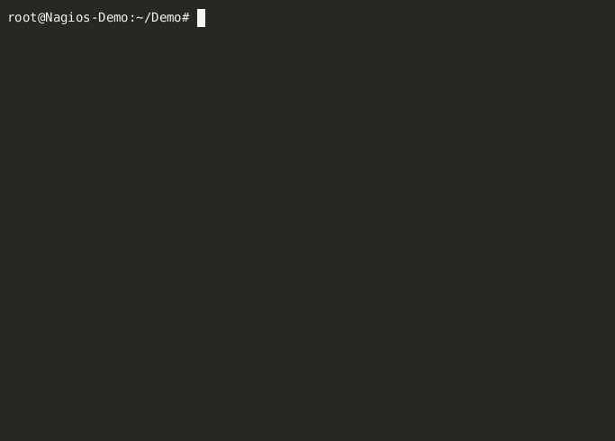

---
title: Adoptium Automated Deployment Of Nagios
date: "2023-05-30T12:00:00+00:00"
author: steelhead31
description: This article demonstrates the Adoptium Nagios deployment playbooks.
tags:
  - Adoptium
  - Infrastructure
  - Nagios
---

## 1. Introduction

The Adoptium project utilises the [Nagios Core](https://www.nagios.org/projects/nagios-core/) product to monitor the infrastructure that is used to provide services to the project. In order to maintain our Nagios monitoring solution an infrastructure-as-code solution has been developed to work alongside our current Ansible and Github based inventory management.

As part of a drive to improve automation, and revitalise the Nagios server, a project was undertaken with the aid of an Outreachy intern. The aim of this project was to improve the coverage and resilience of the Nagios service, and improve the ability to maintain it going forward. The main goals were to have a consistent way to create/recover a Nagios server, and also to improve the process for adding new hosts.

This blog post will cover how the project utilised Ansible & Github to deploy and maintain the Nagios monitoring solution.

These are the key areas covered in this blog:

  - Adoptium Infrastructure Management
  - Deployment of Nagios plugins & monitoring agents on hosts.
  - Setup & Configuration Of A New Nagios Server Instance

There is also previous blog post which provides an overview of how the Nagios solution monitors the infrastructure here: [Adoptium Infrastructure Management With Nagios](https://adoptium.net/blog/2023/03/adoptium-infrastructure-management-with-nagios/).

## 2. Adoptium Infrastructure Management

The Adoptium project utilises a combination of Ansible and Github to help maintain and manage a consistent configuration across the large number of servers in use by the project. All of the elements detailed below, are stored within the [Adoptium Infrastructure Github Repository](https://github.com/adoptium/infrastructure/), alongside relevant documentation. The key elements are:

  Ansible: Ansible is an open-source automation tool that allows you to manage and configure systems. In the context of the Adoptium project, Ansible is used to automate the provisioning and configuration of servers and other infrastructure components.

  Inventory Management: Ansible uses an inventory file that contains information about the hosts and groups of hosts that need to be managed. The [Adoptium inventory file](https://raw.githubusercontent.com/adoptium/infrastructure/master/ansible/inventory.yml) defines the servers, their IP addresses, connection details, and other relevant information, for the servers in use.

  Ansible Playbooks: Ansible playbooks are YAML files that contain a set of instructions, or tasks, to be executed on the managed hosts. These playbooks define the desired state of the infrastructure and automate the deployment and configuration tasks. These playbooks are run periodically both on new and existing hosts to maintain consistent configuration.

  Continuous Integration/Continuous Deployment (CI/CD): Within the Adoptium infrastructure repository, Github actions are leveraged to automate the execution of Ansible playbooks whenever changes are pushed to the repository. This enables automated testing and deployment of infrastructure changes, making the management of the Adoptium project's inventory more efficient. In addition to this, tools such as the VagrantPlayBook check facility within the [Adoptium Jenkins Server][https://ci.adoptium.net/] allow development and testing of any changes to the Ansible playbooks.

In summary, Ansible is used to automate infrastructure provisioning and configuration, while GitHub provides version control and collaboration capabilities for managing the Ansible playbooks and inventory files. This combination allows for efficient and streamlined management of the Adoptium project's inventory.

Useful Links:

- [Infrastructure Repository README](https://github.com/adoptium/infrastructure/blob/master/README.md)
- [Usage Of Ansible](https://raw.githubusercontent.com/adoptium/infrastructure/master/ansible/inventory.yml),

## 3. Demonstration of the Nagios server installation playbooks

This demonstration is being run on an x64 Ubuntu 22.04 virtual machines, which is running in isolation from the production infrastructure.

## 4. Demonstration of the Nagios configuration playbook
