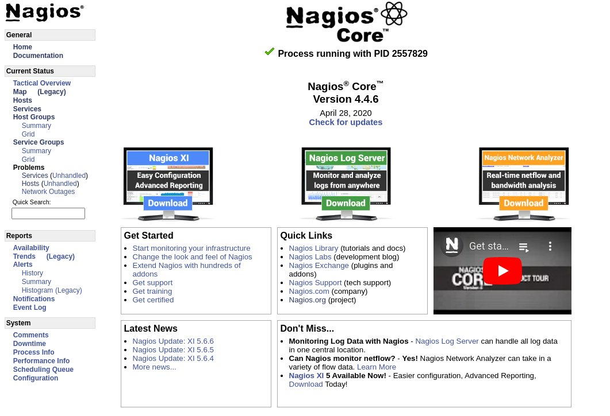
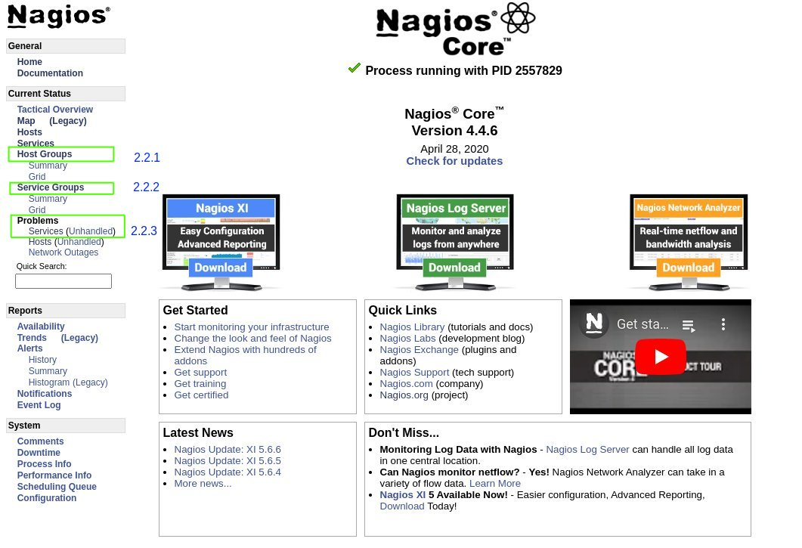
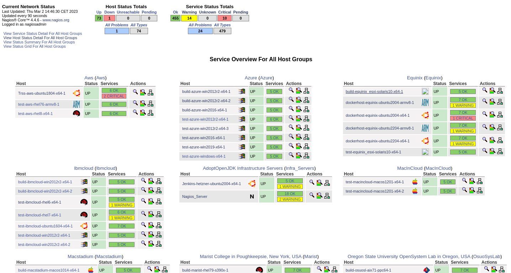
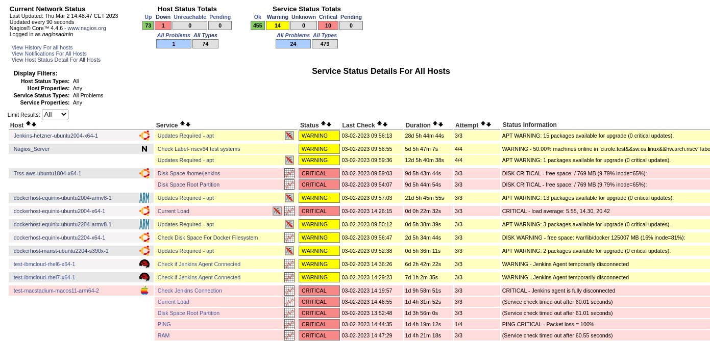

## 1. Introduction

The Adoptium project has a significant amount of infrastructure and servers that are used constantly for many purposes, such as build and test runs, inventory management (via Ansible), the CI/CD tool Jenkins, and more. As such, there is a requirement to proactively monitor the state of this inventory, and prevent significant issues before they arise wherever possible.

To aid in this task, the [Nagios Core](https://www.nagios.org/projects/nagios-core/) product has been implemented to monitor the various machines and services on them, in order to provide early warnings and allow preventative action to be taken.

Useful Links:

- [Visual view of the Adoptium infrastructure](https://github.com/adoptium/infrastructure/blob/master/docs/adoptopenjdk.pdf)
- [Infrastructure Repository README](https://github.com/adoptium/infrastructure/blob/master/README.md)
- [Usage Of Ansible](https://raw.githubusercontent.com/adoptium/infrastructure/master/ansible/inventory.yml),

## 2. How It Works

The Nagios server is responsible for running a series of checks on various servers, to provide an early warning system to help mitigate potential problems. The servers being monitored and the checks taking place are all defined within the Nagios configuration files, and can be updated, amended and extended to suit whatever requirements are needed. In addition the methods of notification and thresholds are also customisable on a per host and service basis. The Adoptium Nagios server is currently set to notify warnings and critical errors directly to the [#infrastructure-bot](https://adoptium.slack.com/archives/C8C212BU6) channel within the Adoptium Slack workspac

### 2.1 Accessing The Adoptium Nagios Server

The Adoptium Nagios server can be accessed via this URL: [https://nagios.adoptopenjdk.net/nagios/](https://nagios.adoptopenjdk.net/nagios/), but it does require a login, which can be requested by logging an issue in the [infrastructure GitHub repository](https://github.com/adoptium/infrastructure/issues). Once logged in you will be presented with the following screen:

### 2.2 Key Features Overview

As shown in the screenshot below, there are 3 key areas which will display the states of the hosts and services being monitored in Nagios. These key areas are highlighted in the screenshot and documented in the named sections below

#### 2.2.1 Nagios Hostgroups Overview

The Nagios configuration allows hosts to be grouped together, as the Adoptium public infrastructure is supplied by a number of different providers, this is a good way to check on the hosts and services on a per provider basis. The Host Groups page shown in the screenshot below allows you to quickly see then number of individual servers, and the status of the services for each individual server on a single page.

#### 2.2.2 Nagios Servicegroups Overview

In addition to the Host Groups grouping detailed in 2.2.1, the Nagios configuration also allows hosts to be grouped together with a second optional grouping known as Service Groups. Currently, there are only two service groups being monitored in this fashion, the docker host servers (which host docker containers) and  Infra servers, which is a specialist group for monitoring key infrastructure servers. The page shown in the screenshot below allows you to quickly see the number of individual servers, and the status of the services for each host allocated to a service group.

#### 2.2.3 Nagios Problems Overview

The final page shown in the screenshot below is a more detailed view of all the warnings and critical issues across the whole set of infrastructure, it allows easy viewing of elements that need attention. These are periodically monitored, and issues are logged within the GitHub Adoptium infrastructure repository to allow remediation works to be carried out, as in some cases, downtime, or potentially the impact of the works may need more than a simple fix.

## 3. Summary

The above guide is provided as an introduction to the monitoring strategy and tools currently in place. Any issues or questions can be raised in the Adoptium slack workspace or within the relevant GitHub repositories. In addition to this, there is also an overview video, which covers all of the above on the Adoptium YouTube channel, [Introduction To Nagios Monitoring At Adoptium](https://www.youtube.com/watch?v=Dr8ymWV-pow)
