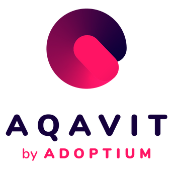

## Eclipse AQAvit Release 1.0.0

I am pleased to announce the Eclipse AQAvit 1.0.0 release and the AQAvit project's graduation from being an incubator project to a mature project.  In the subsequent sections, I will explain what I learned about the Eclipse Foundation release process and how it is different from the [AQAvit releases](https://github.com/adoptium/aqa-tests/releases) we have been actively delivering out of Github for some time now. I will also briefly touch upon some AQAvit achievements and lay down a teaser for the 2024 AQAvit technical roadmap. 

## Opinionated Comments about the Eclipse Foundation release process

The [Eclipse Foundation release process](https://www.eclipse.org/projects/handbook/#release) is focussed on a set of non-technical criteria, which includes Intellectual Property management, Branding and Trademarks, Legal Documentation requirements and Open Source Rules of engagement.  A project can graduate out of incubator status when it passes its first Eclipse release review.  This process is then only required to be revisited on a yearly basis.

I am not a fan of unnecessary process.  As a project lead of the AQAvit project, I had been putting off doing what I considered to be some unwelcome extra 'paperwork' imposed upon me by the Eclipse Foundation. I had considered the Eclipse Foundation release an arbitrary and disconnected statement about the maturity and readiness of a project, especially given that AQAvit has been actively delivering Github releases.  

I learned that the release review process was not as onerous as I had expected.  The Eclipse Foundation is streamlining many of the steps, reviewing and removing some of the previously required pieces of documentation that are not necessary for a project to have in order to prove it is healthy and mature.  Some of the required documentation includes the License, Readme and Contributing files as well as recommended Code of Conduct and Security files be present in every repository within a given Eclipse project.  The AQAvit project which happens to hierarchically be a sub-project of Eclipse Adoptium, has its [7 repositories](https://projects.eclipse.org/projects/adoptium.aqavit/developer) under the Adoptium Github organization, so many of those required files are inherited from the Github organization files.  For the [AQAvit 1.0.0 release review](https://gitlab.eclipse.org/eclipsefdn/emo-team/emo/-/issues/669), there were very few updates needed.   

Having the Eclipse release process look at the metadata and legal aspects of a project means that project leads and committers can focus on the day to day technical work and innovation.  The AQAvit project typically coordinates its Github releases to be available a few weeks ahead of the [JDK release schedule](https://www.java.com/releases) as the many vendors who distribute binaries built from source code originally sourced from the [OpenJDK project](https://openjdk.org/), use AQAvit to verify the quality of the binaries they are producing and distributing.  Because of this, AQAvit produces multiple releases per year in step with the JDK release schedule.  The complementary Eclipse release process for a project only needs to happen once a year as the areas of focus it is concerned with do not change rapidly.

## The Scope of AQAvit

Within the [scope of AQAvit](https://github.com/adoptium/aqa-tests/blob/master/docs/pages/Scope.md) falls both AQAvit verification, which is really a quality bar for JDK binaries and development support especially for JDK developers.  

### AQAvit Verification

Since AQAvit has developed both a consistent and open approach to measuring quality and a useful set of tools to benefit any JDK distributor, it has rapidly become the de facto standard by which companies can measure whether they trust the quality of the distribution they have selected to use.  This is why one of the criteria for listing a distribution in the [Adoptium marketplace](https://adoptium.net/marketplace/) includes the requirement to run and pass the [AQAvit verification suite](https://adoptium.net/docs/aqavit-verification/) of tests.

At this time, there are a good number of vendors listed in the Adoptium marketplace.  The marketplace API includes links to AQAvit results for the different distributions.  This serves as direct evidence of the quality of the binaries listed in the marketplace as well as an indicator of the open and transparent nature of the work.

### Developer Support

AQAvit provides [developer support](https://github.com/adoptium/aqa-tests/blob/master/docs/pages/Scope.md#2-developer-support) both JDK developers and Java application developers through its  publicly visible regular test runs, parameterization and bug tracking.  It is also a flexible system that allows for addition of new test material and for tuning to specific development needs.  [AQAvit was designed](https://github.com/adoptium/aqa-tests/blob/master/docs/pages/LayeredDesign.md) to integrate with various CI/CD tools, including Github Actions, making it a great choice for pull request testing and offering a continuous lens on the quality of code commits.

## Sneak Peek at the 2024 AQAvit Plan

As part of the [AQAvit manifesto](https://github.com/adoptium/aqa-tests/blob/master/docs/pages/Manifesto.md) which is the set of criteria that we created to guide the work in the AQAvit project, we aim to continuously evolve alongside the continuously changing JDK implementations in order to stay relevant and useful.  The 'vit' in AQAvit from the Latin root and reminds us of this criteria to remain vital.  With that in mind, we have a great deal of cool work in the 2024 plan.  

In our upcoming [AQAvit Community call](https://github.com/adoptium/aqa-tests/issues/5090), we will take a look at the targeted items of 2024, including some stretch goals including enhanced developer support through the upcoming Trestle initiative, additional tools to support AQAvit verification and much more.  You can find a list of 2024 features in the proposed agenda, and feel welcomed to join the call or put comments into the [community call issue](https://github.com/adoptium/aqa-tests/issues/5090) to give your input into the activities of the AQAvit project.

