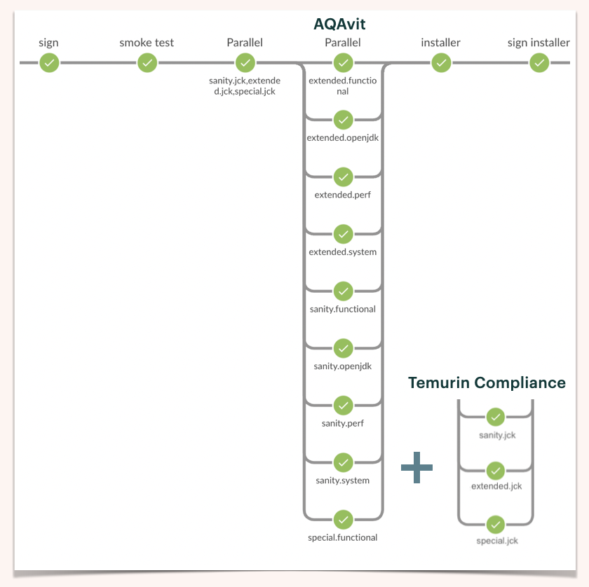
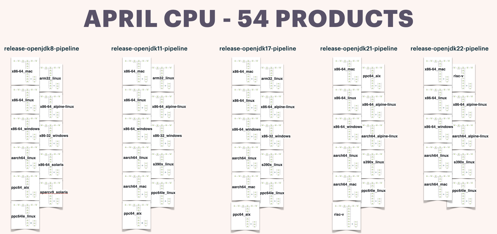

## Eclipse AQAvit Project Scope

Eclipse AQAvit is a very active subproject with the Eclipse Adoptium Working Group. It is a project where a broad set of contributors come together around the topic of quality assurance for OpenJDK builds. By working together in an open-source project, the goal is to share in the workload and activities around testing OpenJDK distributions with the additional goals of deduplicating effort, and freeing folks to work on more innovation!
Within the [scope of AQAvit](https://github.com/adoptium/aqa-tests/blob/master/docs/pages/Scope.md) falls both AQAvit verification, which is really a quality bar for OpenJDK binaries, and development support especially for JDK developers.

### AQAvit Verification

AQAvit has rapidly become the de facto standard by which companies can measure whether they trust the quality of the OpenJDK distribution they are selecting. This trust is earned because AQAvit has developed a consistent and open approach to measuring quality, as well providing an open toolset that any JDK distributor can use to demonstrate that they meet the AQAvit quality bar. This is why one of the criteria for listing a distribution in the [Adoptium marketplace](https://adoptium.net/marketplace/) includes the requirement to run and pass the [AQAvit verification suite](https://adoptium.net/docs/aqavit-verification/).

At this time, there are a number of vendors listed in the [Adoptium marketplace](https://adoptium.net/marketplace/). The marketplace API includes links to AQAvit results for the different distributions. This serves as direct evidence of the quality of the binaries listed in the marketplace as well as an indicator of the open and transparent nature of their quality assurance work.

The Adoptium project uses AQAvit verification for the release activities for its Eclipse Temurin binaries. Since Temurin covers a broad set of platforms and versions, this is an ambitious effort! An overview of the activities of AQAvit testing and triage is covered by this [presentation](https://youtu.be/TWD_b8cwIVg), which takes a look at the January and April 2024 Critical Patch Update (CPU) triage activities.

In summary, millions of tests are run during a release! The test pipelines produce artifacts to show details about which binary is under test, what tests were run against that product, noting where the test material was sourced, whether the product passed those tests, what machines the tests were run on and so forth. These artifacts are then uploaded and made available via the Adoptium marketplace API for reference alongside the binaries.

### Developer Support

AQAvit provides [developer support](https://github.com/adoptium/aqa-tests/blob/master/docs/pages/Scope.md#2-developer-support) both JDK developers and Java application developers through its  publicly visible regular test runs, parameterization and bug tracking.  It is also a flexible system that allows for addition of new test material and for tuning to specific development needs.  [AQAvit was designed](https://github.com/adoptium/aqa-tests/blob/master/docs/pages/LayeredDesign.md) to integrate with various CI/CD tools, including GitHub Actions, making it a great choice for pull request testing and offering a continuous lens on the quality of code commits.

## 2024 AQAvit Plan

As part of the [AQAvit manifesto](https://github.com/adoptium/aqa-tests/blob/master/docs/pages/Manifesto.md) which is the set of criteria that we created to guide the work in the AQAvit project, we aim to continuously evolve alongside the continuously changing JDK implementations in order to stay relevant and useful.  The 'vit' in AQAvit from the Latin root and reminds us of this criteria to remain vital.  With that in mind, we have a great deal of cool work in the 2024 plan.

In our recent [AQAvit Community call](https://github.com/adoptium/aqa-tests/issues/5090), we gave an initial view of some targeted items of 2024, including some stretch goals such as enhanced developer support through the upcoming [Trestle initiative](https://github.com/adoptium/ci-jenkins-pipelines/wiki/Trestle-Initiative), additional tools to support AQAvit verification and much more.  You can find a list of 2024 features in the proposed agenda, and feel welcomed to join and/or put comments into upcoming [community calls](https://github.com/adoptium/aqa-tests/issues?q=is%3Aopen+is%3Aissue+label%3A%22AQAvit+Meeting%22) to give your input into the activities of the AQAvit project.
